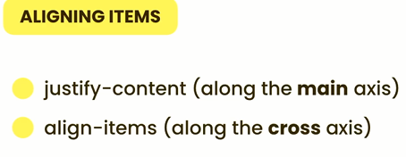
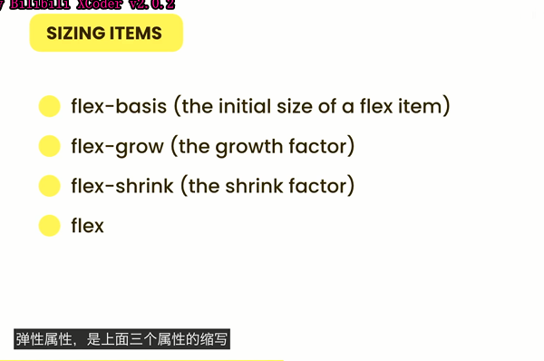

# CSS Layout

# BOX model

margin collapse 

默认增加 pedding and border box会变大

需要添加 

```css
*{
box-sizing : border-box;
}
```

来固定box size

“*”这个选择器不对伪类生效 如

```css
::before 和 ::after
```

需要添加

```css
*, *::before , *::after{
box-sizing : border-box;
}
```

Inline don’t respect the **width** and height **properties**. To give them width and height, we need to give them ‘**display : inline-block** ’ properties

**Overflow:** when use the border-box, if the there is too much content that the box size is not enough, the overflow can happened
By applying the “overflow : hidden, visible, scroll, auto” to deal with the overflow.
Visible is defult state
Hidden is hide the overflow part
Scroll shows the scroll bar to scroll the content
Auto show the scroll bar only when overflow happends
Auto is short for auto vertial and horizontial

Measurement Units


- % 是父级元素大小的百分比
    - 注意：body 元素的默认为横向100%， 纵向0px. 只有再有内容的时候， 纵向大小才会拉伸。
- vw 是视野横向大小的百分比
- vh 是视野属向大小的百分比
- em 是元素内font-size大小的倍数
    - 10em 为 10倍font size of current element
    - 如果当前的element 无 font 属性，则会向父级请求
    - HTML 元素 的默认font size 为 16px
- rem 是root element font-size 的倍数 （16px）

# Positioning

- Static
    - Default state of position
- Relative
    - Position relative to the element’s normal position
- Absolute
    - Relative to the parent
    - the mother element (the container) has to be the relative
    - The element with absolute will be removed from the 默认排版
- Fixed
    - Relative to the viewport
    
    # Flow layout
    
    # Flexbox
    
    
    

Axises




## sizing element (item) for flex



- flex-basis
    - If the flex is set to row, flex basis will rewrite the width  property. If the flex is set to column, flex basis will rewrite the hight  property.
- flex-grow : index
    - Flex grow allow the element to grow to fill the 空的 space
    - the index represent the how fast it grow. 2 grow twice as fast as
- flex-shrink opposit of flex-grow
- flex : flex-grow flex-basis
    - take 1 number and 1 unit
    
    # Grid
    
    
    
    
    
    
    
    unit “fr” the percentage of the free space
    
    # Hiding element
    
    visibility: hidden or none
    
    # 
    
    To ask which device are the user using and to provide different layout, so that the website looks perfect for every devices