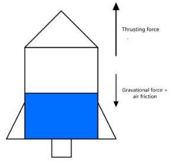
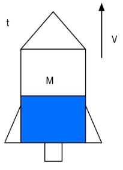
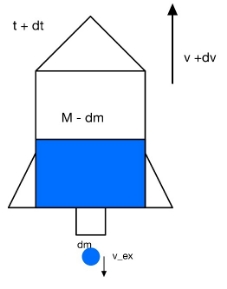
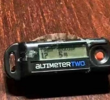
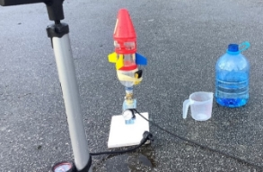

jkl100

Extended Essay May 2021

Physics Extended Essay

**Research question:**

**"How does the air pressure and air to water ratio affect the motion of the water rocket?**

IB code: jkl100

Words count: 3262

Tables: 7

Figures: 17

Equations: 13

# Contents
[**1.**	**Introduction**	1](#_Toc66193064)

[**2.**	**The mathematical analysis and theoretical modeling of the water rocket**	1](#_Toc66193065)

[2.1.	The velocity of ejected water	1](#_Toc66193066)

[2.2.	The motion parameter of water rocket during exhaust phase	3](#_Toc66193067)

[2.3.	The motion parameter of water rocket during exhaust phase	4](#_Toc66193068)

[2.4.	Simulations	6](#_Toc66193069)

[2.4.1.	Relationship between initial pressure and maximum altitude and duration	8](#_Toc66193070)

[2.5.	relationship between initial air to water ratio and maximum altitude and flying duration	11](#_Toc66193071)

[**3.**	**The experimental analysis**	14](#_Toc66193072)

[3.1.	Materials	14](#_Toc66193073)

[3.2.	Fabrication of the water rocket	14](#_Toc66193074)

[3.3.	The method of obtaining parameters collecting data	14](#_Toc66193075)

[3.4.	The effect of air pressure on water rocket projection	19](#_Toc66193076)

[3.4.1.	The data of altitude and distance\	19](#_Toc66193077)

[3.4.2.	Analysis of the data	20](#_Toc66193078)

[3.5.	The effect of water to air ratio on water rocket projection	21](#_Toc66193079)

[3.5.1.	The data of maximum and flying duration	21](#_Toc66193080)

[3.5.2.	Analysis of the data	21](#_Toc66193081)

[**4.**	**Conclusion and Evaluation**	22](#_Toc66193082)

[4.1.	Conclusion	22](#_Toc66193083)

[4.2.	Evaluation	23](#_Toc66193084)

[4.2.1.	Systematic errors	23](#_Toc66193085)

[4.2.2.	Improvements	24](#_Toc66193086)

[5.	References	25](#_Toc66193087)

2

1. ## **Introduction**
During an aerospace workshop that I participated in last summer, I have comprehensively introduced rocket operation's theoretical fundamental principles. The engineering part of the rocket had truly intrigued me. However, the workshop only discussed the rocket in theory. I did not get to put my hands on building a rocket model. Fortunately, this investigation provides me with a perfect opportunity to construct a real water rocket that mimics the operation of an actual rocket. The water rocket's motion is affected by many factors such as the pumped air pressure, shape of the rocket, water to air ratio, mass of the water rocket, and density of the liquid. Among these factors, the pumped air pressure and air to water ratio are of great interest as they are the main factors that vary the motion of the water rocket. In this essay, I will be investigating how these initial conditions factors affect the maximum altitude and flying duration reached by the water rocket. 

1. ## **The mathematical analysis and theoretical modeling of the water rocket**
   1. ## The velocity of ejected water

(Figure 1: The schematic of a water rocket)

1. ` `nose cone, ② air ③water ④bottle ⑤nozzle ⑥fins

The structure of a water rocket is shown in Figure 1. It is composed of a bottle containing water, pumped air, a nozzle, a nose cone for reducing the air resistance, and two fins for stabilizing the water rocket's body. When launching the water rocket, the water rocket is first placed on a launcher with a clip that attaches to the water rocket's nozzle. Then, an air pumper is used to pump the air into the bottle through a one-way valve on the launch pad to the nozzle. Once the air pressure reaches a specific value, the trigger on the launch pad is pressed. The clip that locks the water rocket will be released, so the compressed air rapidly expands and therefore applies a potent force on the water. This force causes the water in the rocket to eject out of the nozzle. By Newton's third law of motion, there is an equal but opposite force presents, and it is upward thrusting force. The result of this reaction force will be the upward acceleration of the water rocket. 

As the air in the water rocket expands, the pressure on the water decreases, the acceleration of the ejected water decreases. Therefore, the velocity of water ejected out is reduced, which leads to a decrease in the normal force caused by the ejected water. However, as the water is ejecting out for gaining an upward force, the total mass of the rocket body decreases along the way, which means the acceleration gain by ejecting water must increase according to Newton's second law. 

Once the water rocket is launched, it will be running out of all the fuels to gain the velocity as much as possible, as the high compress air pumped into the water rocket is expanding. But there is one possible occasion in which the water rocket flies with some leftover water inside due to relatively low initial air pressure or exceeds the initial amount of water inside. When the water rocket's internal air pressure reaches the atmospheric pressure before all the water is ejected out, there will be no pressure difference to push the water out of the rocket. The exceed initial amount of water makes the water rocket overweighted. Hence, the water rocket becomes too heavy to be pushed away by the ejecting water, and it touches the ground before the fuel running out.

During the time of flying of the water rocket, there are only three types of forces on the water rocket. These are the reaction force from water ejection, gravitational force, and air friction. The reaction force only takes place in a very short time because water ejects at a rapid rate. The gravitational force and air friction act on the water rocket for the entire process. The gravitational force is always pushing the water rocket downward, while the air friction is proportional to the velocity of the water rocket (opposite to the direction of the velocity).

(Figure 2: Free body diagram of the water rocket when a rocket is in motion)

The process of water rocket flying can be divided into two stages – the water exhausting stage and the inertial motion stage. On the water exhausting stage, the water is ejected at a relatively high speed in a short time, and the water rocket is pushed in a opposite direction and gaining the velocity needed to stay in the air. After the water exhausting stage then comes the inertial motion stage. Only gravitational force and air friction are acting on the water rocket until the water rocket touches the ground.
1. ## The motion parameter of water rocket during exhaust phase
The water inside the water rocket is pushed out by high pressure during the water exhaust stage. The water flow is formed in the rocket from the bottle to the nozzle and be ejected out. Assuming the water flow inside of the rocket is ideal fluid (Incompressible, zero viscosity, and flows steadily along a streamline) so it satisfies the conditions for using Bernoulli's Equation

P1+12ρv12+ρgh-dl=P2+12ρv22+ρgh.

Taking one point at the surface of the water, another point at the bottom of the nozzle, we obtain

P+12ρvin2+ρgh=Pa+12ρvex2,#1

where P0 is the initial air pressure (pumped air pressure), ρw is the density of the water, vin and vex  are the water flow velocity in the rocket body and at the nozzle, respectively. Because the water rocket is launched vertically to the ground, so h is the distance between the water's surface to the bottom of the nozzle, and g is the gravitational acceleration. 

The water ejecting rates in the rocket body and at the nozzle can be obtained by multiplying vw and vex with their corresponding cross-sectional area, which is equivalent to the increase rate of volume of air which is given by the equation of continuity as the following

dVdt=Svin=Sexvex.#2

where Sex is the cross-sectional area of nozzle, and S is the average cross-sectional area of the water rocket, which can be calculated as S=VbL (Vb is the volume of the bottle, and L is the total length of the bottle). The reason for doing this is because in a real-life experiment, measuring the volume usually brings much error. Representing the volume in terms of the cross-sectional area can eliminate the source of error to some extent.

In equation (2), solve for vw in terms of ve , and substitute into equation (1), we can get an expression for vex

vex=2P-Paρ1-SexS2.#3

The water exhausting stage only takes a very short time (usually less than 1 second) which means the gas in the bottle has no time to exchange heat with the outside during the expansion process, which can be reasonably approximated as adiabatic expansion. As the water is ejected out from the rocket, the volume of air expends. Assuming the pumped air is ideal gas (negligible particle volume and intermolecular attraction and the expansion is adiabatic), we have

P0V0k=PVk,#4

where V0 is the initial volume of air, P is the air pressure, V is the volume of air and k is the thermodynamic constant for gas, usually 1.4. 

Note that V0 and V can also be represented as V0=SL-h0 and V=SL-h, where h0 represents the initial water level, and h0-h represent the height of water.

Solve for P0 in equation (4), and substitute to the equation (3), we get 

vexh=2P0SL-h0SL-hk-Pa+2ρghρ1-SexS2 .#5

Note here the interval of h is 0,h0.
1. ## The motion parameter of water rocket during exhaust phase
According to Newton's third law, the upward force that acts on the rocket is equal to the force that ejects water out of the rocket. The force acting on the ejected water can be represented by mass flow dmdt times the velocity of the mass of water ejected out from the rocket, which is vex, 
`                                                                     `Ft=vexdmdt                                                          (6) 

where dmdt also means the volume flow rate times the density of the water ρ, and the volume flow rate is represented by vexSex. So, the equation becomes

`                                                 `Ft=vexdmdt=vex2Sexρ                                                          (7)

solve for dm

dm(h)=vex(h)Sexρdt#8

From equation (2), solve for dt 

dth=SSexvexhdh#9

As the rocketed is launched (as the diagram is shown below),

             

(Figure 3: The water rocket before and after dm is ejected)

the velocity is v with the mass of M. After dt second, the rocket gains velocity of v, and ejects a mass of water dm. Along the process, the external forces are gravity (Mg) and air resistance (12CAρavv). 

According to the momentum theory 

M-dmv+dv+dmv-vex-MV=dtMg+12CAρavv,

solve for dv 

dv=-Mg-12CρaAvv+ρSexvexMdt, #(10)

substitute dt from equation (9), we obtain:

dvh=S-Mg-12CρaAvhvh+ρSexvexhMSexdh. #(11)# 

Integrate both sides, and we have a function of velocity v with respect of h:

`                   `vh=hohS-Mg-12CρaAvhvh+ρSvexhMSexvexhdh               (12)

The change in displacement can be represented by: 

dD=vdt #13

1. ## Simulations
Through the equations derived above, all parameters of the water rocket, such as displacement, velocity, acceleration, can be obtained with respect to time. 

Due to the functional relationship of those parameters, the motion of the water rocket will be simulated by numerical iteration from the initial conditions.

For the simulation, the initial value for t, v, D are set at 0. The required initial parameters are listed in Table 1. The simulation can be divided into two parts: before the water exhaust phase and after the water exhaust phase. For the water exhaust phase, the decrease in water level can be modelled by taking a small decrement of water level dh every time so that the water level h become (h0-ndh): n represents the number of iterations. Inserting the value to the function vexh from equation 5, we can get a value vex. Using the value of vex, we can get the value of dt, dv,dD from equation (9), (11) and (13) above. Repeat this process until the water level is equal to 0.

After the water exhaust phase, using a small increment of time dt to get dv* and dD from the equations (10) and (13), and add to the D, v, t that we get from the previous iteration. Repeat this process until the D=0 (i.e. the water rocket touches the ground).

(Figure 4: the flow chart of the program that calculates the motion of the water rocket)
1. ## ` `Relationship between initial pressure and maximum altitude and duration
Through the equations derived in 3.2, the data of the motion of the water rocket can be calculated based on the constants listed in the table below. 

Table 1: The initial parameters of water rocket for the simulation

|**Parameters**|**Figure**|**Unit**|**Assumption**|
| :-: | :-: | :-: | :-: |
|Atmospheric pressure (Pa)|101325|pa|Constant temperature and a negligible difference in atmospheric pressure as rocket ascend higher.|
|Mass of the water rocket with water (M)|0.4|kg|Constant water density|
|Initial height of water level (ho)|0.083|m|-|
|Total length of water rocket (L)|0.25|m|-|
|Average cross-section area of water rocket (S)|0.00456|m2|The rocket is a perfect cylinder.|
|Area of nozzle (Sex)|3.73×10-5|m2|The nozzle is a perfect cylinder.|
|Density of water (ρ)|997|kgm-3|Constant temperature|
|Density of air (ρ)|1.2|kgm-3|Constant temperature|
|Air resistance coefficient (C)|0.3|-|Constant temperature and humidity|
|Gravitational acceleration (g)|9.8|ms-2|Experiments are conducted at the same location.|
|Thermodynamic constant (k)|1.4|-|k is constant for gas.|

(Figure 5: Graph of height reached by the water rocket against flying time at different pressure)

(Figure 6: Graph of maximum altitude against the internal pressure of the water rocket)

(Figure 7: Graph of maximum altitude against the internal pressure of the water rocket)

Through the graphs shown in Figure 6 and 7 above, both the maximum flying altitude and the duration increase as the pressure increases and the rate of ascending decreases as the pressure increases. It is worth noting that from 160 kPa to 200 kPa, the rate of ascending is increasing. It is mainly due to insufficient pressure, causing some water leftover in the rocket when it landed.

1. ## relationship between initial air to water ratio and maximum altitude and flying duration
In this simulation, we will try the following initial water-air ratios: 1:12, 2:12, 3:12, 4:12, 5:12, 6:12, 7:12, 8:12. 9:12, 10:12 and 11:12. Assume the mass of the water rocket without the water is m0=0.02, the initial mass of water rocket M can be calculated by M=m0+hsρw. With the initial conduction below:

Table 2: The initial parameter of water rocket for the simulation

|**Parameters**|**Figure**|**Unit**|**Assumption**|
| :-: | :-: | :-: | :-: |
|Atmospheric pressure (Pa)|101325|pa|Constant temperature and a negligible difference in atmospheric pressure as the  rocket ascends er.|
|Mass of the water rocket with water (M)|0.4|kg|Constant water density|
|Initial height of water level (ho)|0.083|m|-|
|Total length of water rocket (L)|0.25|m|-|
|Average cross-section area of water rocket (S)|0.00456|m2|The rocket is a perfect cylinder.|
|Area of nozzle (Sex)|3.73×10-5|m2|The nozzle is a perfect cylinder.|
|Density of water (ρ)|997|kgm-3|Constant temperature|
|Density of air (ρ)|1.2|kgm-3|Constant temperature|
|Air resistance coefficient (C)|0.3|-|Constant temperature and humidity|
|Gravitational acceleration (g)|9.8|ms-2|Experiments are conducted at the same location.|
|Thermodynamic constant (k)|1.4|-|k is constant for gas.|
|Internal air pressure (P0)|500000|Pa|The rocket is perfectly sealed and there is no leakage of air.|

Table 3: Initial mass and water level of water rocket and the maximum height and flying duration

|**Water to air ratio**|**Initial mass** M **(kg)**|**The initial height of water level** h0 **(m)**|**Maximum altitude (m)**|**Flying duration(t)**|
| :-: | :-: | :-: | :-: | :-: |
|1:12|0.115|0.021|29.666|5.044|
|2:12|0.209|0.042|35.305|5.578|
|3:12|0.304|0.063|37.702|5.884|
|4:12|0.399|0.083|38.737|6.282|
|5:12|0.494|0.104|38.794|6.413|
|6:12|0.588|0.125|40.322|6.434|
|7:12|0.683|0.146|36.123|6.331|
|8:12|0.778|0.167|2.633|5.463|
|9:12|0.872|0.188|3.1063|1.900|
|10:12|0.967|0.208|0.6222|1.026|
|11:12|1.062|0.229|0.0793|0.378|

(Figure 8: Graph of maximum altitude against the water to air ratio of the water rocket)

(Figure 9: Graph of flying duration against the water to air ratio of the water rocket)

From Figure 8 and 9, the maximum altitude and the flying duration appear when the water to air ratio is 1: 1. As the ratio increase from 1: 12, the maximum altitude and the flying duration increase, but the rate of changing decreases until 6:12. After 6: 12, the value starts to decrease, and the rate of change increases. Finally, after 9: 12, the rate starts to decrease again.

1. ## **The experimental analysis**
   1. ## Materials
Table 4, the materials for the experiment

|Launcher |Base, Port, plank, hinge, tube, pressure gauge (±20 kPa), bicycle pump|
| :- | :- |
|Water rocket|Two Coke bottle (1 L), nozzle, four fins, tape, altimeter (±1 m), nose cone|
|Others |Ruler (±0.1 cm), vernier caliper (±0.001 cm), camera (±0.05 s), measuring cup (±25 mL), scissor, cooking scale (±0.01 g), water bucket|

1. ## Fabrication of the water rocket
Firstly, take two 1 L coke bottles. We use one of them as the main body of the water rocket, and another one is attached to the main body at the opposite side of the nozzle. 4 fins are attached to the main rocket body by the tape and the glue. Each fin is at a 90° angle to the other adjacent fins. The specially designed nozzle is on the opening side of the main body.  

As Figure 11, the rocket launcher is made of a rocket port, pressure gauge, hinge, and adapter to connect to the pump. To launching the rocket, first, fill the rocket body with water, then insert the nozzle into the rocket port. There is a buckle inside of the rocket port for launching the rocket at a certain pressure. Because in this essay, we only look at a perfectly vertical launch, so we adjust the hinge to 90 degrees. After that, pump the air into the rocket through the adapter and, as the pressure increased to a certain amount, release the buckle of the rocket so that the rocket will ascend by ejecting the water. 

1. ## The method of obtaining parameters collecting data
The atmosphere pressure (Pa) is obtained by the weather report on the day of the experiment.

A pressure gauge is connected to the air cock, which is used to measure the internal air pressure of the water rocket, which shows the P0-Pa, therefore the initial air pressure P0 can be determinate by adding the number from the pressure gauge on the atmospheric pressure. 

Cross-sectional area (Sex) of the nozzle can be determent by the vernier clipper with great precision. (±0.001m).

The length of the chamber (L) and water level (h0) exceeded the vernier clipper's measuring range, so I used a long ruler (1m). 

The volume of the rocket chamber (V0) is obtained by fill up the bottle with water using a measuring cup. Then average cross-sectional area (S) is V0/L.

The mass of the whole water rocket (M) will measure by a cooking scale.

The maximum altitude of the water rocket ejection can be measure by an altimeter. 

The flying duration can be determined by video recording of the flying process of the rocket and use video software to find the time between the rocket launched and the rocket landed.

The shape of a water rocket is close to the long cylinder with an air resistance coefficient of 0.8 according to [7], but the nose cone makes it better than a long cylinder, so we can assume the resistance coefficient of a water rocket is about 0.7.

(Figure 10, method of measure water heigh)

(Figure 11, launching the water rocket)

(Figure 13: data collected from the altimeter)						(Figure 14, the setup of the experiment)

1. ## The effect of air pressure on water rocket projection
We change the air pressure to see the change in maximum altitude and the flying duration, so the pressure is the independent variable. The maximum altitude and flying duration are the dependent variables. In this experiment, I will fill the rocket with 350mL of water.

Table 5: The initial parameters of water rocket for the experiment and simulation

|**Parameters**|**Figure**|**Unit**|
| :-: | :-: | :-: |
|Atmospheric pressure (Pa)|102120 (±20000)|Pa|
|Mass of the water rocket with water (M)|0.5015 (±0.0001)|kg|
|Total length of water rocket (L)|0.252 (±0.01)|m|
|
Initial height of

water level (h0)
|0.0892 (± 0.01)|m|
|Area of nozzle (Sex)|7.57\*10^-5 (±1.5\*10^-7)|m2|
|Average cross-section area of water rocket (S)|0.00452 (±0.001)|m2|
|Density of water (ρ)|997|kg/m3|
|Density of air (ρ)|1.4|kg/m3|
|Air resistance coefficient (C)|
0.7

|-|
|Gravitational acceleration (g)|9.8|ms-2|
|Thermodynamic constant (k)|1.4|-|

1. ## The data of altitude and distance\

Table 6: data of maximum fly altitude and duration in different pressure

|Pressure (kPa) (±25)|Maximum altitude (m) (±1)|Flying duration (s) (±0.01)|
| :- | :- | :- |
|200|0|0|
|300|13|3.08|
|400|14|3.94|
|500|16|4.12|
|600|18|4.14|
|700|19|4.21|

1. ## Analysis of the data

(Figure 14: graph of maximum altitude reached by rocket against pressure, plotted both the graphs of simulation and experiment in the parameters list in table 5)

(Figure 15: graph of the flying duration of the rocket against pressure, plotted both the graphs of simulation and experiment in the parameters list in table 5)

We can see that the graphs of experimental results preserve the same shape as that of the simulation. However, the experimental results deviate from the simulation as the pressure increases. This deviation was the result of different initial parameters. Nevertheless, we can conclude from both experiment and simulation that the maximum altitude reached by the rocket increases as the pressure increases and the flying of the rocket increases as the pressure difference increases. 

1. ## The effect of water to air ratio on water rocket projection
   1. ## The data of maximum and flying duration
In this experiment, we are changing the water to air ratio and looking at how it affects the maximum altitude and flying duration. We set the pressure at 400 kPa ± 20, and the independent variable is the amount of water, and the dependent variables are maximum and flying duration.

Table 7: The initial parameters of the water rocket for the experiment and simulation

|Volume of water (mL) (± 25mL)|Water to air ratio (±0.001)|Water level (cm) (±1m)|Maximum altitude (±1m)|Flying duration (±0.1m)|
| :- | :- | :- | :- | :- |
|100|0.086|4.62|11|2.96|
|200|0.173|6.57|12|3.03|
|300|0.260|7.90|13|3.12|
|400|0.347|9.94|13|3|
|500|0.434|11.85|14|2.98|
|600|0.521|14.1|10|2.99|
|700|0.608|16.41|8|2.78|
|800|0.695|17.96|4|1.93|
|900|0.782|19.76|0|1.15|
|1000|0.869|21.58|0|0.23|

1. ## Analysis of the data

(Figure 16: graph of maximum altitude reached by rocket against the air to water ratio plotted both the graphs of simulation and experiment in the parameter list in table 5and 6)

Figure 16 shows that the experimental results and simulation results again have a very similar pattern. The maximum altitude reached by the rocket in the experimental result is the greatest (14m ±1m) when the air to water ratio is 0.434 ± 0.02. While in the theoretical, the maximum altitude reached by the rocket in the experimental result is the greatest (26.46 ±1m) when the air to water ratio is 0.173 ± 0.02.

(Figure 17: graph of maximum duration reached by rocket against the air to water ratio, plotted both the graphs of simulation and experiment in the parameter list in table 5 and 6)

From figure 17, we can observe that the flying duration (3.12 ±0.01s) for experimental results occurs when the air to water ratio is 0.26. The maximum flying duration (4.79s ±0.01s) for simulation results occurs when the air to water ratio is 0.173 ± 0.02. The difference is due to different initial parameters. From these two graphs, we can conclude that to reach the greatest flying time and altitude, the air to water ratio should be between 0.26-0.434 (±0.02).

1. ## **Conclusion and Evaluation** 
   1. ## Conclusion
Overall, through both simulation and experimental results, we have arrived at the following two answers to our initial research question: ***"How does the initial pumped air pressure, air to water ratio affect the motion of the water rocket?"***

1)The higher the initial pumped air pressure, the longer, the higher the water rocket flies. The relationship is weakened as pressure increases.

2)The optimal air to water ratio that allows the highest and longest flight of the water rocket is between 0.26-0.434 (±0.02).

The experimental data shows a similar trend with simulation, although there is some deviation, which demonstrates the validity of the simulation. The possible reason for the deviation will be explained in the Evolution part. For replicating this experiment, the choice of air to water ratio in the range of 0.26-0.434 (±0.02) should be at the discrete value of the experimental parameter. Therefore, the experimenter should try different ratios between 0.26- 0.434 (±0.02) in this range to see, which is the most optimal.

1. ## Evaluation 
   1. ## Systematic errors
1. The friction between the launcher and nozzle was not qualitative detected at the experiment to have resulted in the inaccuracy of the final results. 

1. Water rocket rotates while flying, losing energy, which might have caused the frictional force experienced by the water rocket to vary along with the flight duration, which might have affected the rocket's upward motion. 

1. Not perfectly vertical ejection, the horizontal displacement occurs, especially when the pressure is high, which might be the main issue that caused the results to deviate from the simulation. I usually walk 10-20 steps from the launcher for picking up the water rocket after launching in the experiments that involve air pressure over 300kPa. That could explain the experimental data deviate from the simulation more and more as the pressure increase. 

1. The unjustified approximation of the coefficient of air resistance could also create errors. Significantly, the errors increase as the pressure increase because the air resistance is proportional to the square of velocity.

1. Assumptions of ideal gas, steady flow and perfect cylinder were not valid in every situation, resulting in some experiment errors. The assumption of a perfect cylinder deviates the most, which the bottom of the water rocket is not a cylinder at all; instead, it is a hemispheroid about 400mL, but as the water-air ratio increases, it becomes closer and closer to the assumption. That explains the experimental data deviate from the calculation as the water-air ratio is low, and the deviation gets smaller and smaller as the ratio increase. 

1. According to the altimeter's instruction, the altimeter detects the altitude based on an atmospheric air pressure sencer that I do not know what the principle is. Therefore, the reliability of the data obtained by the instrument is doubted. 

1. The uncertainty of measurement and human reading errors could let the actual parameters of the water rocket different from the simulation, which cause the discrepancy of the data.

1. ## Improvements 
This experiment could have been improved if the rocket is specifically designed and not with coke bottles. Advanced technology such as a 3D printer could produce a perfect rocket body and lower the barycenter (preventing rotation) to minimize the error. Also, improving the equations, which include more real-world parameters, could be considered and measured for developing the model, as many assumptions made in this model omitted a fair number of parameter values. Moreover, the coefficient of air resistance needs to be experimentally justified, as it will provide a more accurate parameter to put into the simulation and provide a better prediction for reality. Finally, a better method of determinate the altitude of a water rocket is needed. 

1. ## References 
[1] Finney, G. A. (2000). Analysis of a water-propelled rocket: A problem in honors physics. *American Journal of Physics,* *68*(3), 223-227. doi:10.1119/1.19415

[2] Kagan, D., Buchholtz, L., & Klein, L. (1995). Soda‐bottle water rockets. *The Physics Teacher,* *33*(3), 150-157. doi:10.1119/1.2344175

[3] Liao, L., Yang, X., & Grade, T. (2016). THEORETICAL INVESTIGATION OF THE LAUNCH INITIAL VELOCITY AND THE LAUNCH DISTANCE FOR THE WATER ROCKET. *Physics and Engineering*.

[4] Water Rocket Physics. (n.d.). Retrieved November 13, 2020, from https://www.real-world-physics-problems.com/water-rocket-physics.html

[5] 冯, 冠. (2018). 水火箭的理论探讨. *《新课程》2018年 第6期*.

[6] 王超, 金盈, 谢妙, & 陈英. (2017). 水火箭运动的理论研究. *《物理通报》2017年 第6期*.

[7] Steven De Groote. (2009). Aerodynamics in racing. Retrieved February 26, 2021, from https://www.f1technical.net/articles/10

[8] AltimeterTwo. (n.d.). Retrieved February 26, 2021, from https://jollylogic.com/products/altimetertwo/
2

